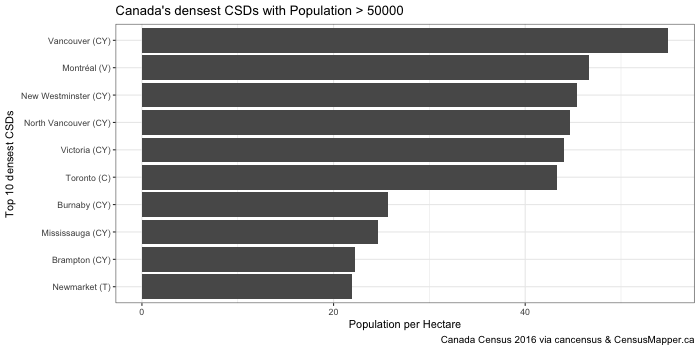
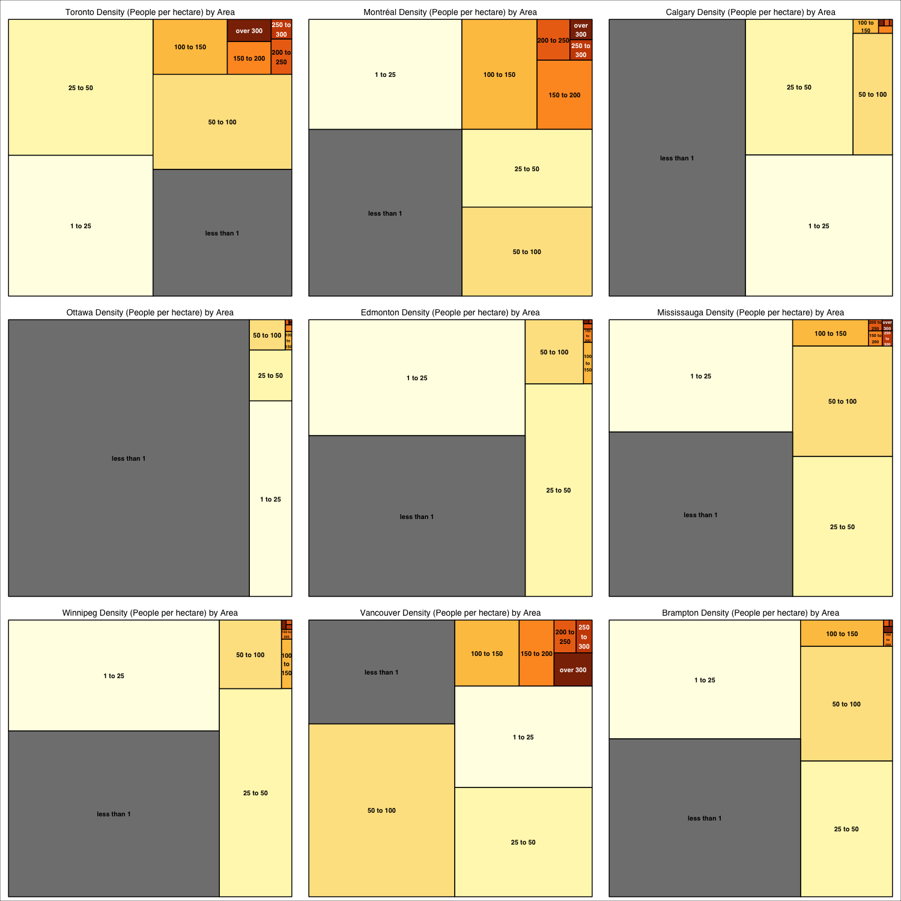
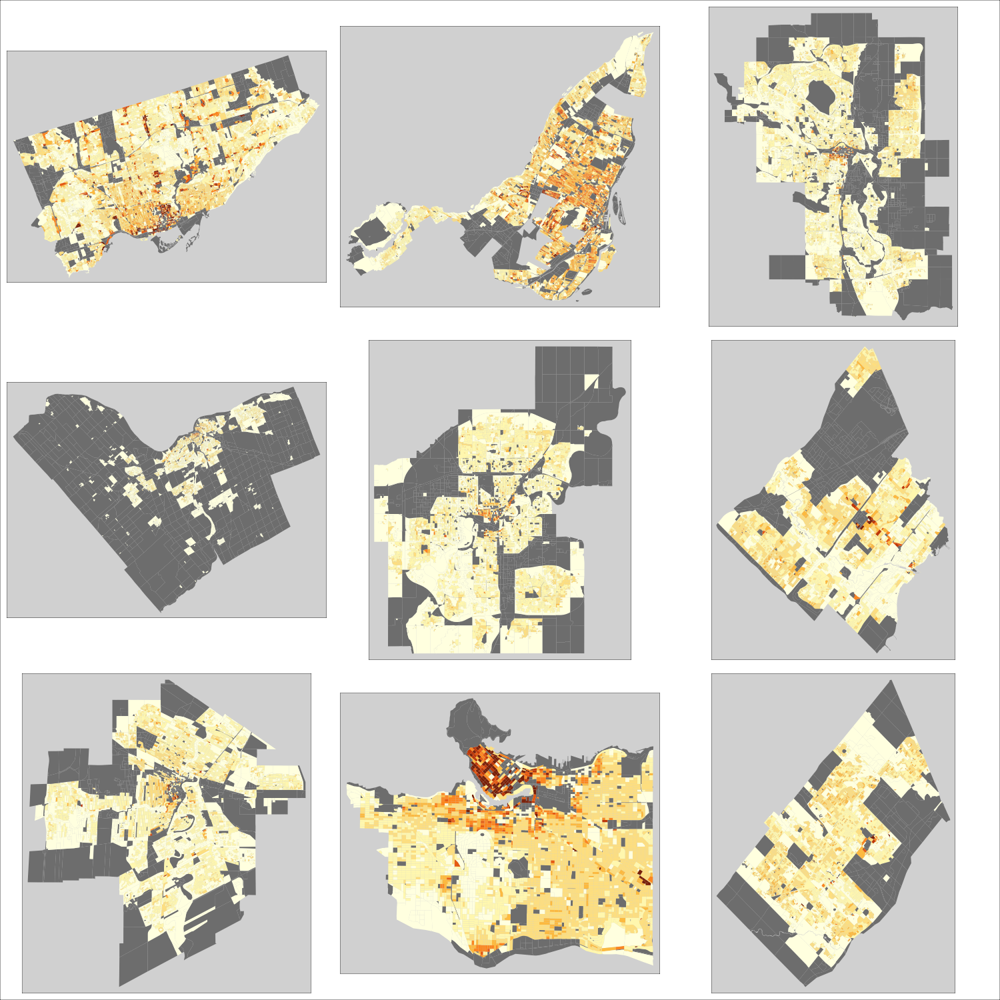

# density-explorations
Using [cancensus](https://github.com/mountainMath/cancensus) to explore population density in Canadian cities.

The purpose is to demonstrate how to use cancensus to pull in and analyse census data. The R notebook produces the following four graphs.

## Density of CMAs

## Density of CSDs

## Density by Area

## Density by Population

## Density by Geography

