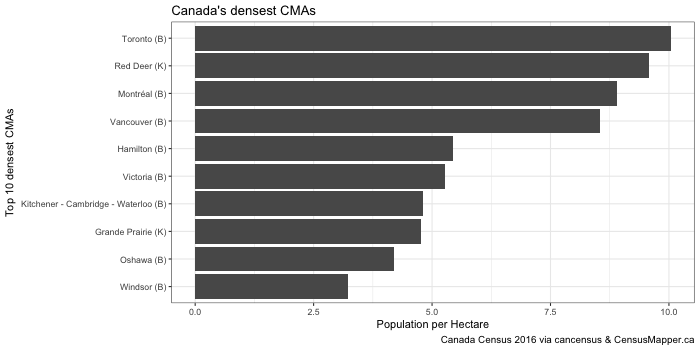
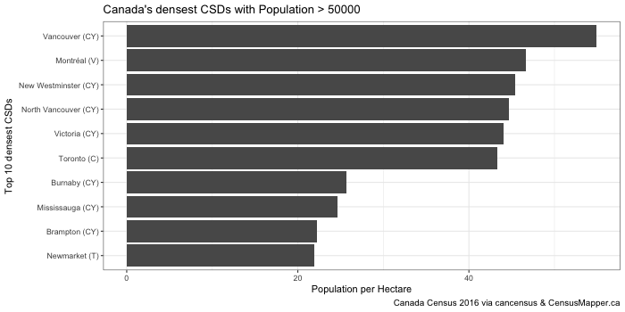
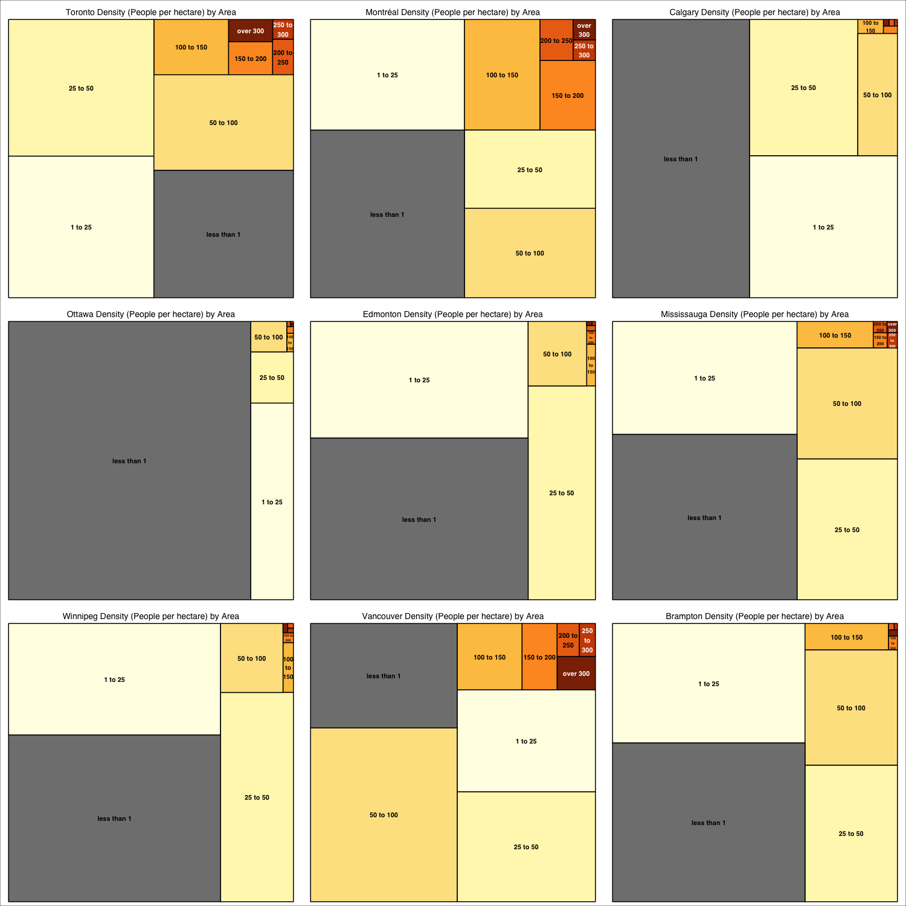
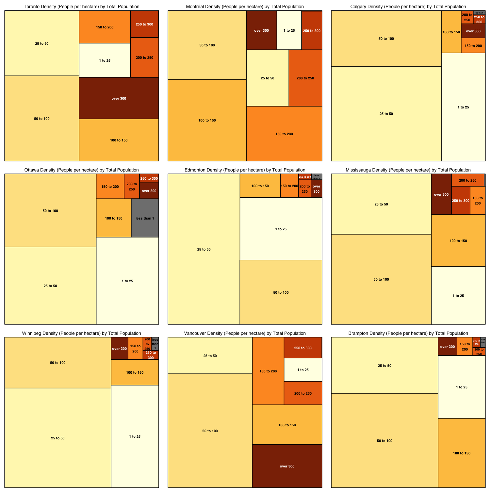
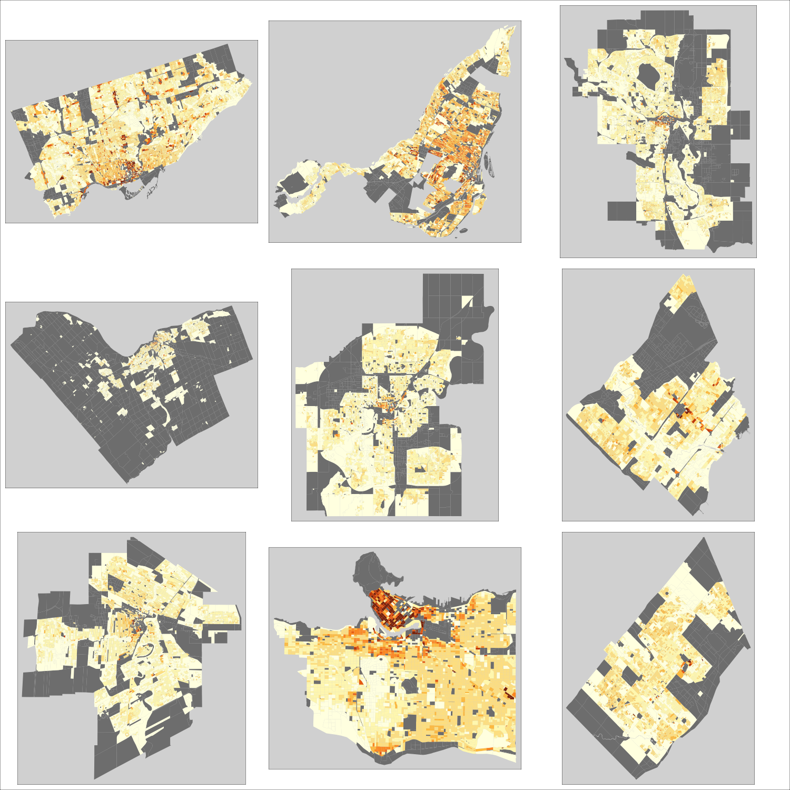

```{r setup, include=FALSE}
library(cancensus)
dir.create('images', showWarnings = FALSE) # make sure image directory exists
dataset='CA16'
# options(cancensus.api_key='<your API key>')
```


## Overview
This is a quick demonstration project on how to use [cancensus](https://github.com/mountainMath/cancensus)
to analyse Canadian census data. It produces a couple of images saved to the "images" folder.

## Population Density CMAs

```{r cmas, message=FALSE, warning=FALSE}
regions=list_census_regions(dataset) %>% filter(level=='CMA') %>% as_census_region_list

census_data <- get_census(dataset = dataset, regions = regions, vectors = c("v_CA16_406"), geo_format = NA, level='Regions', labels = 'short') %>%
  select("Region Name","v_CA16_406") %>%
  mutate(pph = v_CA16_406/100)

census_data$name=census_data[["Region Name"]]

library(ggplot2)
png('images/densest_CMAs.png', width=700, height=350)
ggplot(census_data %>% top_n(10,pph) , aes(x = reorder(name,pph), y = pph)) +
  geom_bar(stat = "identity") +
  labs(x = "Top 10 densest CMAs", y = "Population per Hectare", title="Canada's densest CMAs",caption="Canada Census 2016 via cancensus & CensusMapper.ca") +
  theme_bw() + coord_flip()
dev.off()

```


## Population Density CSDs

```{r csds, message=FALSE, warning=FALSE}
csd_cutoff=50000
regions=list_census_regions(dataset) %>% filter(level=='CSD') %>% filter(pop>= csd_cutoff) %>% as_census_region_list

census_data <- get_census(dataset = dataset, regions = regions, vectors = c("v_CA16_406"), geo_format = NA, level='Regions', labels = 'short') %>%
  select("Region Name","v_CA16_406") %>%
  mutate(pph = v_CA16_406/100)

census_data$name=census_data[["Region Name"]]

png('images/densest_CSDs.png', width=700, height=350)
ggplot(census_data %>% top_n(10,pph) , aes(x = reorder(name,pph), y = pph)) +
  geom_bar(stat = "identity") +
  labs(x = "Top 10 densest CSDs", y = "Population per Hectare", title=paste0("Canada's densest CSDs with Population > ",csd_cutoff),caption="Canada Census 2016 via cancensus & CensusMapper.ca") +
  theme_bw() + coord_flip()
dev.off()

```


## Density in the 9 Largest Canadian Cities
We look at the nine larges Canadian cities and map density geographicall, by area and by population.

```{r density_logic, fig.height=10, fig.width=10, message=FALSE, warning=FALSE}
#regions <- c("5915022") # city of vancouver
regions <- list_census_regions('CA16') %>% filter(level=='CSD') %>% top_n(9,pop)

cutoffs <- c(-Inf, 1, 25, 50, 100, 150, 200, 250, 300, Inf)
labels <- c("less than 1", "1 to 25", "25 to 50", "50 to 100", "100 to 150", "150 to 200", "200 to 250", "250 to 300", "over 300")

library(RColorBrewer)
palette <- c('#808080',brewer.pal(length(labels)-1,'YlOrBr'))

size=1500

library(treemap)
library(grid)
vSize="Area (sq km)"
description="Density (People per hectare) by Area"
do_treemap <- function(ind){
  vp <- viewport(layout.pos.row=(ind-1) %/% 3 +1, layout.pos.col=(ind-1) %% 3 +1)

  region=regions[ind,]
  census_data <- get_census(dataset='CA16', 
                            regions=as_census_region_list(region), 
                            level='DB', 
                            geo_format = NA, 
                            vectors=c("v_CA16_406","v_CA16_407"), 
                            labels='short') %>%
    mutate(pph = Population/`Area (sq km)`/100.0) %>%
    mutate(density= cut(pph,breaks=cutoffs, labels=labels))
  
    #png(filename=paste0(region$name,"_density.png"))
  treemap(census_data, 
          index="density", 
          vSize= vSize, 
          vColor= "density", 
          type="categorical",
          palette=palette,
          algorithm='squarified',
          sortID="color",
          title=paste(region$name,description, sep=" "),
          fontsize.title = 14,
          position.legend = 'none', vp=vp)
    #dev.off()
  NULL
}

library(tmap)
do_map <- function(ind){
  vp <- viewport(layout.pos.row=(ind-1) %/% 3 +1, layout.pos.col=(ind-1) %% 3 +1)
  region=regions[ind,]
  census_data <- get_census(dataset='CA16', 
                            regions=as_census_region_list(region), 
                            vectors=c("v_CA16_406","v_CA16_407"), 
                            level='DB', 
                            geo_format = 'sp', labels='short') 
  census_data@data <- census_data@data%>%
    mutate(pph = Population/`Area (sq km)`/100.0) %>%
    mutate(density= cut(pph,breaks=cutoffs, labels=labels))

  map <- tm_shape(census_data) +
    tm_fill("density", color=NA, textNA="none", title="People per hectare", palette=palette) +
    tm_style_grey(legend.show=FALSE)
  print(map, vp)
  NULL
}
```

```{r density_area, fig.height=10, fig.width=10, message=FALSE, warning=FALSE}
png('images/density_area.png', width=size, height=size)
grid.newpage()
grid.rect()
pushViewport(viewport(layout=grid.layout(3, 3)))
lapply(seq_len(nrow(regions)), do_treemap)
popViewport()
dev.off()
```



```{r density_pop, fig.height=10, fig.width=10, message=FALSE, warning=FALSE}
png('images/density_population.png', width=size, height=size)
vSize="Population"
description="Density (People per hectare) by Total Population"
grid.newpage()
grid.rect()
pushViewport(viewport(layout=grid.layout(3, 3)))
lapply(seq_len(nrow(regions)), do_treemap)
popViewport()
dev.off()
```


```{r density_map, fig.height=10, fig.width=10, message=FALSE, warning=FALSE}
png('images/density_map.png', width=size, height=size)
grid.newpage()
grid.rect()
pushViewport(viewport(layout=grid.layout(3, 3)))
lapply(seq_len(nrow(regions)), do_map)
popViewport()
dev.off()
```





